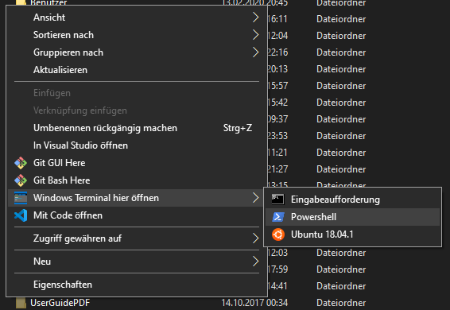

# windowsterminal_here
Adds "Open Windows Terminal here" option to the context menu when right-clicking inside a directory

## Instructions
1. Copy wt_contextmenu folder to your C drive
2. Double-click windowsterminal_here.reg

## Add/remove/modify profiles
You can add any windows terminal profile to the context menu.
To do so, append following to the .reg file:

Line 3: Caption of the menu item
Line 4: Icon of the menu item (optional, remove line for no icon)
Line 7: Name of the windows terminal profile

    ; menu item for powershell profile
    [HKEY_CLASSES_ROOT\Directory\Background\shell\terminal\shell\powershell]
    @="Powershell"
    "Icon"="C:\\wt_contextmenu\\Powershell.ico"

    [HKEY_CLASSES_ROOT\Directory\Background\shell\terminal\shell\powershell\command]
    @="\"C:\\wt_contextmenu\\startwt.bat\" \"-d\" \"%v.\" -p \"Windows PowerShell\""
